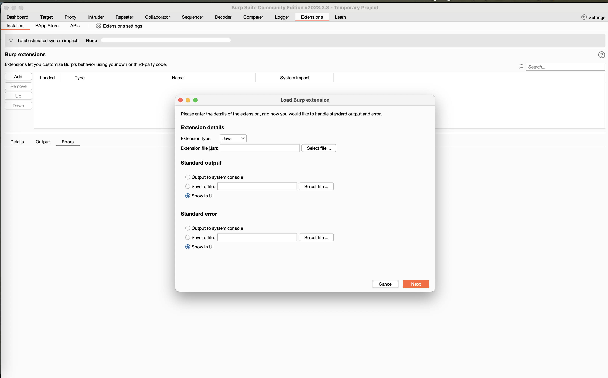
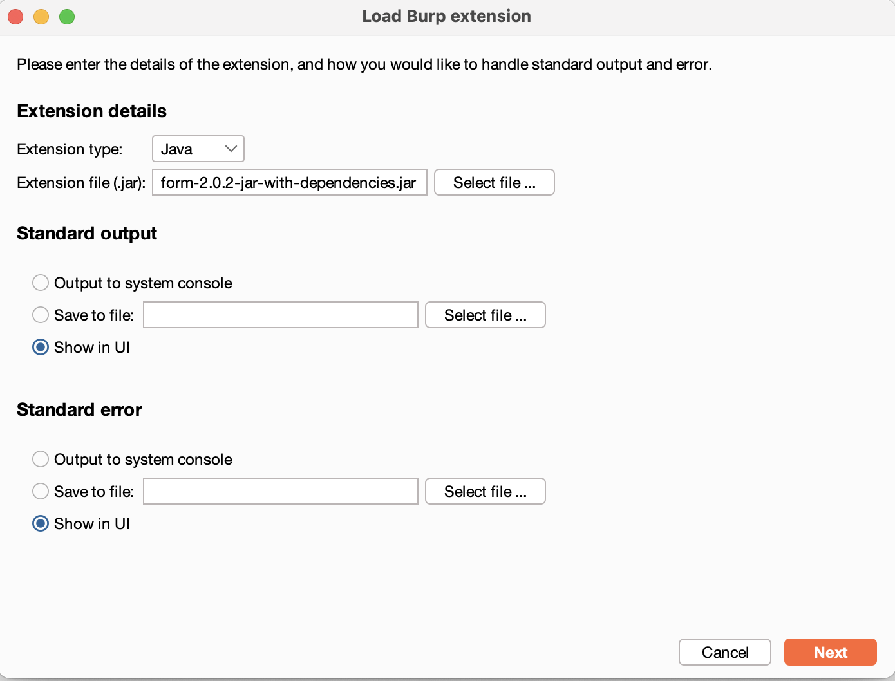
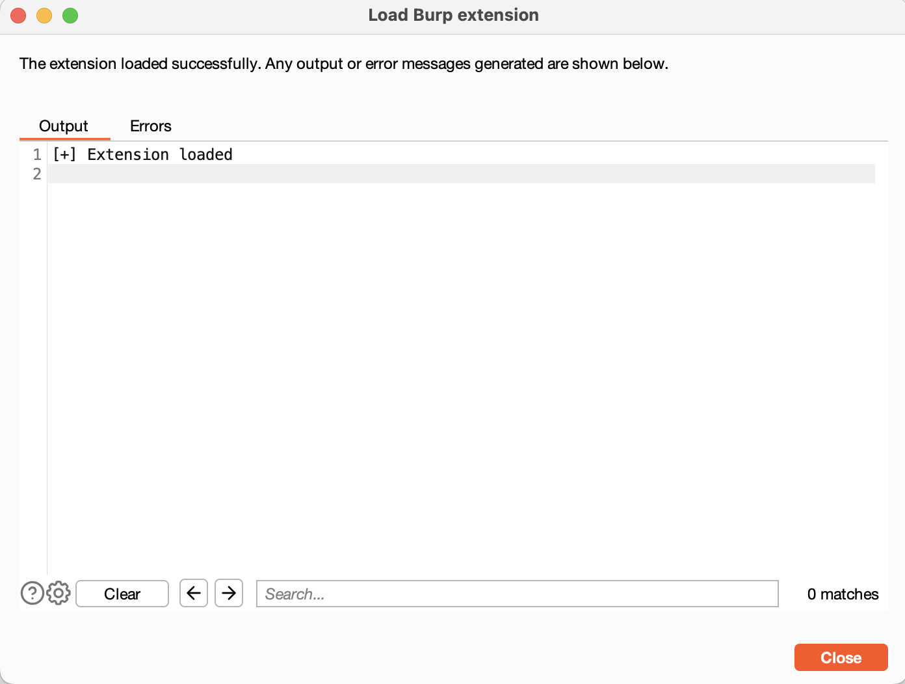
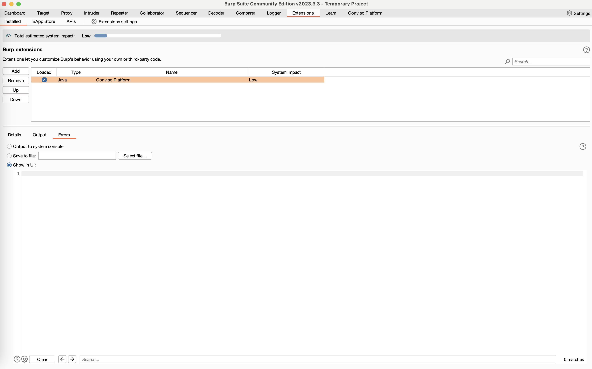
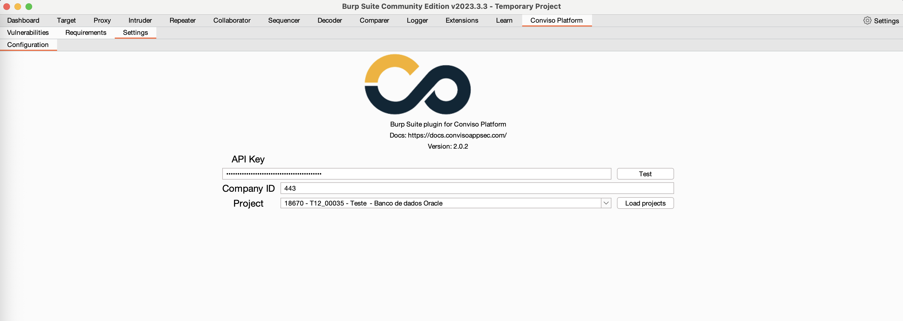
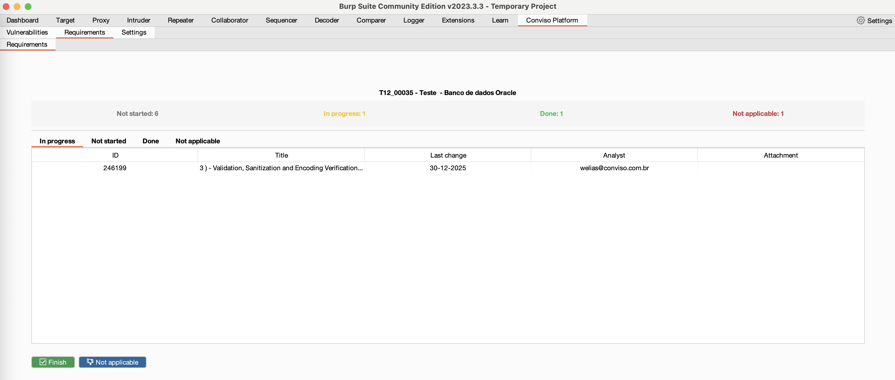

<p align="center">
  
  <p align="center">BurpSuite Conviso Platform Extension</p>
  <p align="center">
    <a href="/LICENSE.md">
      
    </a>
    <a href="https://github.com/convisolabs/Burp-ConvisoPlatform/releases">
      
    </a>
  </p>
</p>

---

### Summary

[Conviso Platform](https://www.convisoappsec.com/conviso-platform) is Conviso’s application security platform that centralizes risk, testing, and remediation workflows. This Burp Suite extension connects your findings directly to Conviso Platform, so analysts can register vulnerabilities, track requirements, and keep projects aligned in one place. See the docs at [https://docs.convisoappsec.com/](https://docs.convisoappsec.com/).

---

### Download and install

You can find the last release: [here](https://github.com/convisolabs/Burp-ConvisoPlatform/releases)

### Install in Burp

1) Open the **Extensions** tab and click **Add**.



2) Choose **Java**, select the jar with dependencies, and keep output set to **Show in UI**.



3) Click **Next** to load the extension.



4) Confirm the extension loaded successfully.



---

### Screenshots

**Settings**



**Vulnerabilities**


**Requirements**



---

### Documentation

You can find the full documentation at: [https://docs.convisoappsec.com/](https://docs.convisoappsec.com/)

---

### Build from source

```bash
$ git clone https://github.com/convisolabs/Burp-ConvisoPlatform.git
$ cd Burp-ConvisoPlatform
$ mvn -DskipTests package
```

The bundled jar is generated at:

```
target/Burp-ConvisoPlatform-<version>-jar-with-dependencies.jar
```

### Contributing

1. Fork the repository and create a feature branch.
2. Keep changes focused and update documentation when behavior changes.
3. Build locally with `mvn -DskipTests package` before opening a PR.
4. Open a pull request with a clear description of the change.

See the contribution guidelines: [CONTRIBUTING.md](/.github/CONTRIBUTING.md).  
Report bugs via the [issues page](https://github.com/convisolabs/Burp-ConvisoPlatform/issues) and see the [security policy](/SECURITY.md) for security issues.

---

### License

- This work is licensed under [MIT License.](/LICENSE.md)
